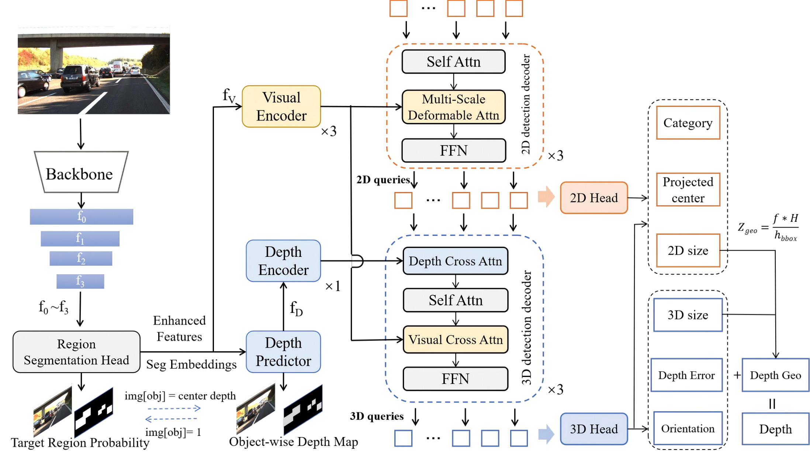
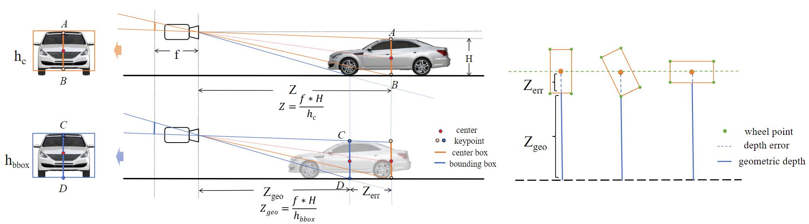
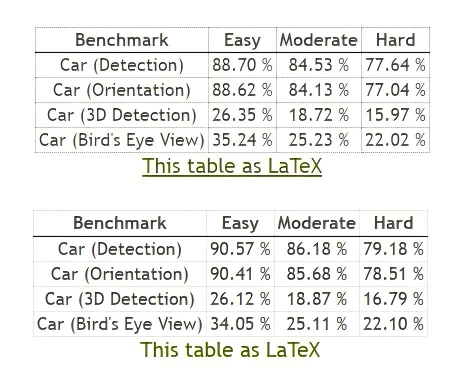
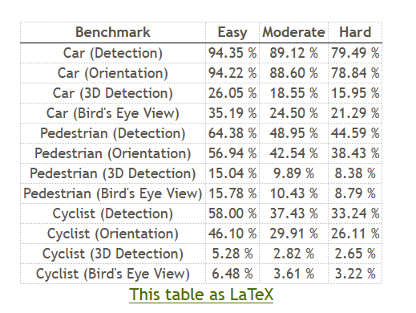

# MonoDGP: Monocular 3D Object Detection with Decoupled-Query and Geometry-Error Priors


This repository hosts the official implementation of [MonoDGP: Monocular 3D Object Detection with Decoupled-Query and Geometry-Error Priors](https://arxiv.org/abs/2410.19590) based on the excellent work [MonoDETR](https://github.com/ZrrSkywalker/MonoDETR). In this work, we propose a novel transformer-based monocular method called MonoDGP, which adopts geometry errors to correct the projection formula. We also introduce a 2D visual decoder for query initialization and a region segmentation head for feature enhancement.


<div align="center">
  
</div>

<div align="center">
  
</div>


The official results in the paper:

<table>
    <tr>
        <td rowspan="2",div align="center">Models</td>
        <td colspan="3",div align="center">Val, AP<sub>3D|R40</sub></td>   
    </tr>
    <tr>
        <td div align="center">Easy</td> 
        <td div align="center">Mod.</td> 
        <td div align="center">Hard</td> 
    </tr>
    <tr>
        <td rowspan="4",div align="center">MonoDGP</td>
        <td div align="center">30.7624%</td> 
        <td div align="center">22.3421%</td> 
        <td div align="center">19.0144%</td> 
    </tr>  
</table>


New and better results in this repo:

<table>
    <tr>
        <td rowspan="2",div align="center">Models</td>
        <td colspan="3",div align="center">Val, AP<sub>3D|R40</sub></td>   
        <td rowspan="2",div align="center">Logs</td>
        <td rowspan="2",div align="center">Ckpts</td>
    </tr>
    <tr>
        <td div align="center">Easy</td> 
        <td div align="center">Mod.</td> 
        <td div align="center">Hard</td> 
    </tr>
    <tr>
        <td rowspan="4",div align="center">MonoDGP</td>
        <td div align="center">30.9663%</td> 
        <td div align="center">22.4953%</td> 
        <td div align="center">19.9641%</td> 
        <td div align="center"><a href="https://drive.google.com/file/d/1ccwmKmxjJMtiD5GAYMlB9Acz_sV2gtwJ/view?usp=sharing">log</a></td>
        <td div align="center"><a href="https://drive.google.com/file/d/1Nddzx3xDE0DPZzVluR9HEYRgH2wALU9z/view?usp=sharing">ckpt</a></td>
    </tr>  
  <tr>
        <td div align="center">30.7194%</td> 
        <td div align="center">22.6883%</td> 
        <td div align="center">19.4441%</td> 
        <td div align="center"><a href="https://drive.google.com/file/d/1mjk457aBjxs6a3Lf-biX10_YzhW2th_U/view?usp=sharing">log</a></td>
        <td div align="center"><a href="https://drive.google.com/file/d/1eCON928oVFTL2U64qZotWYhRCRopldxY/view?usp=sharing">ckpt</a></td>
    </tr>  
  <tr>
        <td div align="center">30.1314%</td> 
        <td div align="center">22.7109%</td> 
        <td div align="center">19.3978%</td> 
        <td div align="center"><a href="https://drive.google.com/file/d/1-WfZo2lsocfABoTxb1CbYyKd8HCDGDR7/view?usp=sharing">log</a></td>
        <td div align="center"><a href="https://drive.google.com/file/d/1nfCiFIxCIm0WG--cbllkqzgeuVRPpNI5/view?usp=sharing">ckpt</a></td>
    </tr>  
</table>


We also provide a new ckpt pretrained on the trainval set, you can directly utilize this ckpt and submit test results to the [KITTI 3D object detection benchmark](https://www.cvlibs.net/datasets/kitti/user_login.php) (You need to register an account) to verify our method.

<table>
    <tr>
        <td rowspan="2",div align="center">Models</td>
        <td colspan="3",div align="center">Test, AP<sub>3D|R40</sub></td>   
        <td rowspan="2",div align="center">Ckpts</td>
        <td rowspan="2",div align="center">Results</td>
    </tr>
    <tr>
        <td div align="center">Easy</td> 
        <td div align="center">Mod.</td> 
        <td div align="center">Hard</td> 
    </tr>
    <tr>
        <td rowspan="4",div align="center">MonoDGP</td>
        <td div align="center">26.12%</td> 
        <td div align="center">18.87%</td> 
        <td div align="center">16.79%</td> 
        <td div align="center"><a href="https://drive.google.com/file/d/190HOri7sBeUxa2bt--H6bUW_m-jXIJr9/view?usp=sharing">ckpt</a></td>
        <td div align="center"><a href="https://drive.google.com/file/d/1fDecBmfGQvs8ZI6ag7upicsVIlJlxQZ4/view?usp=sharing">data</a></td>
    </tr>  
</table>

Test results submitted to the official KITTI Benchmark:

Car category: 
<div>
  
</div>

All categories:
<div>
  
</div>


## Installation
1. Clone this project and create a conda environment:
    ```bash
    git clone https://github.com/PuFanqi23/MonoDGP.git
    cd MonoDGP

    conda create -n monodgp python=3.8
    conda activate monodgp
    ```
    
2. Install pytorch and torchvision matching your CUDA version:
    ```bash
    # For example, We adopt torch 1.9.0+cu111
    pip install torch==1.9.0+cu111 torchvision==0.10.0+cu111 torchaudio==0.9.0 -f https://download.pytorch.org/whl/torch_stable.html
    ```
    
3. Install requirements and compile the deformable attention:
    ```bash
    pip install -r requirements.txt

    cd lib/models/monodgp/ops/
    bash make.sh
    
    cd ../../../..
    ```
 
4. Download [KITTI](http://www.cvlibs.net/datasets/kitti/eval_object.php?obj_benchmark=3d) datasets and prepare the directory structure as:
    ```bash
    │MonoDGP/
    ├──...
    │data/kitti/
    ├──ImageSets/
    ├──training/
    │   ├──image_2
    │   ├──label_2
    │   ├──calib
    ├──testing/
    │   ├──image_2
    │   ├──calib
    ```
    You can also change the data path at "dataset/root_dir" in `configs/monodgp.yaml`.
    
## Get Started

### Train
You can modify the settings of models and training in `configs/monodgp.yaml` and indicate the GPU in `train.sh`:
  ```bash
  bash train.sh configs/monodgp.yaml > logs/monodgp.log
  ```
### Test
The best checkpoint will be evaluated as default. You can change it at "tester/checkpoint" in `configs/monodgp.yaml`:
  ```bash
  bash test.sh configs/monodgp.yaml
  ```
You can test the inference time on your own device:
  ```bash
  python tools/test_runtime.py
  ```
## Citation

If you find our work useful in your research, please consider giving us a star and citing:

```latex
@article{pu2024monodgp,
  title={MonoDGP: Monocular 3D Object Detection with Decoupled-Query and Geometry-Error Priors},
  author={Pu, Fanqi and Wang, Yifan and Deng, Jiru and Yang, Wenming},
  journal={arXiv preprint arXiv:2410.19590},
  year={2024}
}
```

## Acknowlegment
This repo benefits from the excellent work [MonoDETR](https://github.com/ZrrSkywalker/MonoDETR).
